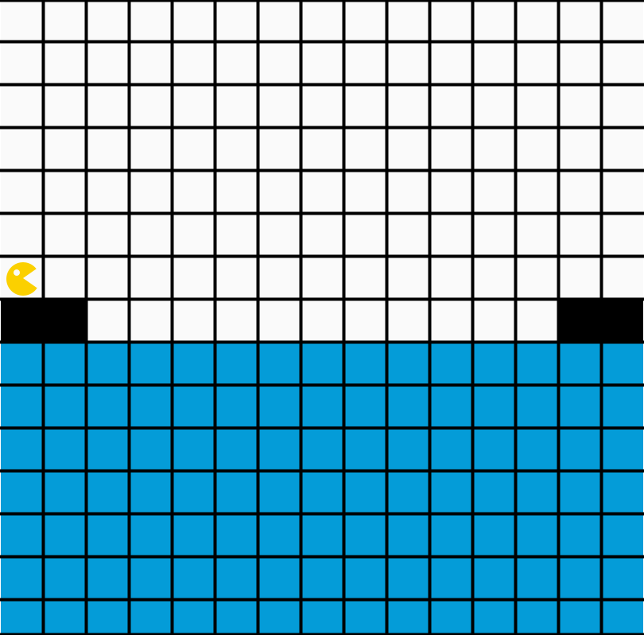

# Studienleistung I: Bouncer | 2. Bouncer baut eine Brücke

## Allgemeine Hinweise zur Studienleistung
In dieser Studienleistung werden Sie drei Programmieraufgaben lösen.
Diese Programmieraufgaben sind auf drei Projekte - pro Teilaufgabe ein Projekt - aufgeteilt.
Um die Aufgaben zu bearbeiten, müssen Sie zuerst das jeweilige Projekt in IntelliJ öffnen.
Diese Projekte sind:
* ```Studienleistung-I-Bouncer-1-BouncerMaltEineSpirale```
* ```Studienleistung-I-Bouncer-2-BouncerBautEineBrücke```
* ```Studienleistung-I-Bouncer-3-BouncerGraebtNachKristallen```

Für die Teilaufgabe, die in diesem Dokument beschrieben ist, öffnen Sie bitte das Projekt: ```Studienleistung-I-Bouncer-2-BouncerBautEineBrücke```

Nutzen Sie zum Lösen der einzelnen Aufgaben die bereitgestellten Klassendateien.
Zum Einreichen Ihrer Aufgaben nutzen Sie die entsprechende Funktion in GRIPS.
Falls Sie Problemen mit dem Starterpaket oder dem Einreichen der Aufgabe haben, können Sie sich in den Handouts auf GRIPS informieren.

Achtung: Eine Verlängerung der Abgabefrist ist nicht möglich.
Einreichungen, die uns (zu spät) per E-Mail erreichen, werden nicht mehr berücksichtigt.
Alle nicht eingereichten Aufgaben werden mit nicht bestanden bewertet.
Testen Sie den Upload am besten schon vor Ablauf der Frist in Ruhe: Sie können bis zum Abgabetermin beliebig viele neue Lösungen einreichen.

Bewertungskriterien: Für die gesamte Studienleistung gilt, dass die eingereichten Lösungen nur die in der Aufgabenstellung beschriebenen Probleme lösen sollen.
Lassen Sie keinen Teil der jeweiligen Aufgabe weg und interpretieren Sie die Fragestellung nicht selbstständig.
Bewertet wird, in wie weit Sie das beschriebene Problem vollständig lösen.
Wenn Sie die Aufgaben erfolgreich bearbeitet haben, können Sie Ihre Lösung gerne kreativ gestalten und erweitern; achten Sie dabei darauf, dass die eigentlichen Anforderungen weiterhin erfüllt bleiben.
Die Qualität Ihres Codes fließt in die Gesamtbewertung mit ein: Nutzen Sie Decomposition um Ihre Programme übersichtlich zu gestalten.
Verwenden Sie sinnvolle Bezeichner für Variablen und Methoden und kommentieren Sie ausreichend.
Beachten Sie dazu die Kriterien für guten und schlechten Code, die in der Vorlesung erwähnt wurden.

Sollten Sie Fragen haben oder Hilfe brauchen, können Sie im Discord unter der Kategorie Support in den Channel Studienleistung uns eine Nachricht hinterlassen.
Wir stehen Ihnen dann zeitnah zur Seite über eine Direktnachricht.


## Ausgangslage
Bouncer steht auf der linken Seite der Karte an einem Ufer.
Bouncer erspäht auf der rechten Seite der Karte ein anderes Ufer.
Bouncer will eine Brücke bauen um das Ufer an dem Bouncer steht mit dem anderen Ufer zu verbinden.

| Bouncer steht am linken Ufer. | Bouncer Bouncer hat eine Brücke gebaut und steht am rechten Ufer am Rand der Welt. |
|:------:|:------:|
|  |  |

## Aufgabe

Lösen Sie folgende Teilaufgaben, damit Bouncer eine Brücke baut

1. Bouncer muss das Ende des Festlandes finden
2. Bouncer muss die Brücke bauen, beginnend am Festland
3. Ab dem Festland muss Bouncer alle *zwei* Felder einen Brückenpfeiler bauen, damit die Brücke nicht einbricht
4. Bouncer geht am rechten Ufer bis zur Kante der Karte


* **Hinweise**
